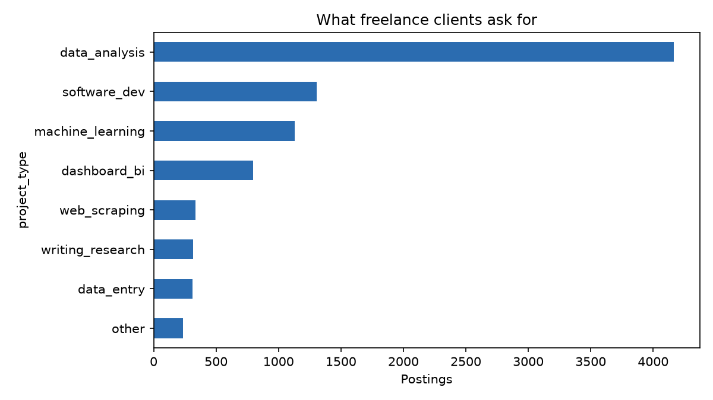
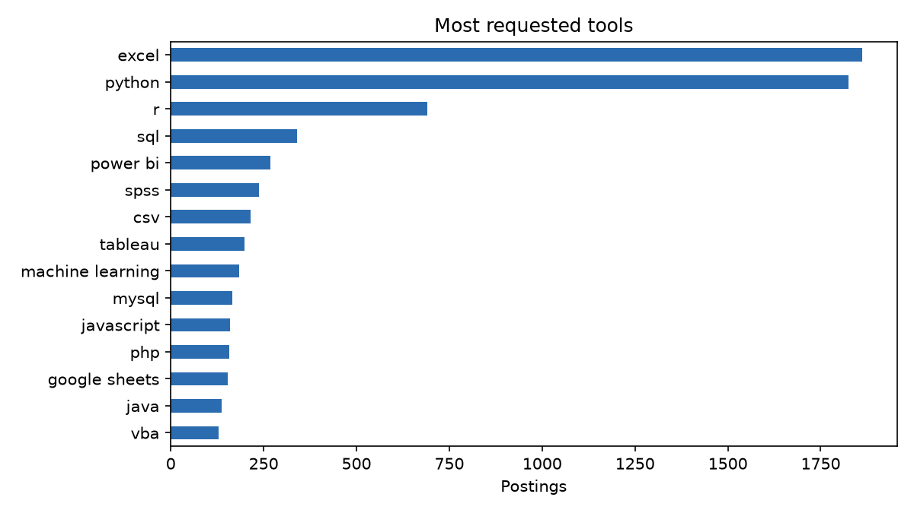

# Freelance job postings, extracted

8595 postings processed.

## How reliable is the extraction?

- 97.1% of postings passed every check (quotes found in the text, numbers present).
- Problems found: {'quote for red_flags is not in the posting': 10, 'experience_level has no supporting quote': 162, 'quote for experience_level is not in the posting': 45, 'quote for stated_budget is not in the posting': 9, 'stated_budget has no supporting quote': 9, 'quote for timeline_days is not in the posting': 7, 'timeline_days has no supporting quote': 1, 'red_flags has no supporting quote': 2}.
- A budget was written in the text for 3.1% of postings. A model that invents values would report far more.

## Project types

| project_type     |   postings |
|:-----------------|-----------:|
| data_analysis    |       4164 |
| software_dev     |       1305 |
| machine_learning |       1130 |
| dashboard_bi     |        798 |
| web_scraping     |        335 |
| writing_research |        315 |
| data_entry       |        311 |
| other            |        237 |

## Most requested tools

|                  |   postings |
|:-----------------|-----------:|
| excel            |       1862 |
| python           |       1825 |
| r                |        690 |
| sql              |        341 |
| power bi         |        269 |
| spss             |        238 |
| csv              |        214 |
| tableau          |        198 |
| machine learning |        184 |
| mysql            |        166 |
| javascript       |        159 |
| php              |        157 |
| google sheets    |        154 |
| java             |        136 |
| vba              |        129 |

## Experience level asked for, by project type (share of postings)

| project_type     |   entry |   expert |   intermediate |   not_stated |
|:-----------------|--------:|---------:|---------------:|-------------:|
| dashboard_bi     |    0    |     0.27 |           0.04 |         0.69 |
| data_analysis    |    0.01 |     0.22 |           0.03 |         0.74 |
| data_entry       |    0.03 |     0.08 |           0.05 |         0.85 |
| machine_learning |    0.01 |     0.29 |           0.03 |         0.67 |
| other            |    0.03 |     0.3  |           0.1  |         0.58 |
| software_dev     |    0.01 |     0.28 |           0.07 |         0.65 |
| web_scraping     |    0    |     0.13 |           0.03 |         0.84 |
| writing_research |    0.03 |     0.18 |           0.06 |         0.73 |

## Urgency, ongoing work and timeline, by project type

| project_type     |   postings |   urgent |   ongoing |   median_days |
|:-----------------|-----------:|---------:|----------:|--------------:|
| dashboard_bi     |        798 |     0.07 |      0.13 |            14 |
| data_analysis    |       4164 |     0.12 |      0.07 |             3 |
| data_entry       |        311 |     0.11 |      0.13 |             7 |
| machine_learning |       1130 |     0.07 |      0.07 |             7 |
| other            |        237 |     0.07 |      0.24 |            30 |
| software_dev     |       1305 |     0.1  |      0.16 |            14 |
| web_scraping     |        335 |     0.08 |      0.16 |             7 |
| writing_research |        315 |     0.09 |      0.08 |             7 |

## Red flags (count)

|                      |   postings |
|:---------------------|-----------:|
| off_platform_contact |        295 |
| vague_brief          |        751 |
| free_work_requested  |         68 |

## Project mix in the 8 biggest client countries (share of postings)

| country              |   dashboard_bi |   data_analysis |   data_entry |   machine_learning |   other |   software_dev |   web_scraping |   writing_research |
|:---------------------|---------------:|----------------:|-------------:|-------------------:|--------:|---------------:|---------------:|-------------------:|
| Australia            |           0.11 |            0.56 |         0.01 |               0.09 |    0.03 |           0.11 |           0.07 |               0.03 |
| Canada               |           0.09 |            0.47 |         0.03 |               0.12 |    0.06 |           0.14 |           0.04 |               0.04 |
| India                |           0.1  |            0.45 |         0.06 |               0.14 |    0.03 |           0.17 |           0.03 |               0.03 |
| Pakistan             |           0.05 |            0.55 |         0.02 |               0.16 |    0.05 |           0.1  |           0.03 |               0.04 |
| Saudi Arabia         |           0.12 |            0.53 |         0.02 |               0.14 |    0.02 |           0.1  |           0.02 |               0.06 |
| United Arab Emirates |           0.15 |            0.48 |         0.01 |               0.12 |    0.02 |           0.16 |           0.03 |               0.04 |
| United Kingdom       |           0.08 |            0.52 |         0.02 |               0.13 |    0.03 |           0.12 |           0.05 |               0.05 |
| United States        |           0.1  |            0.53 |         0.03 |               0.1  |    0.04 |           0.12 |           0.04 |               0.03 |

